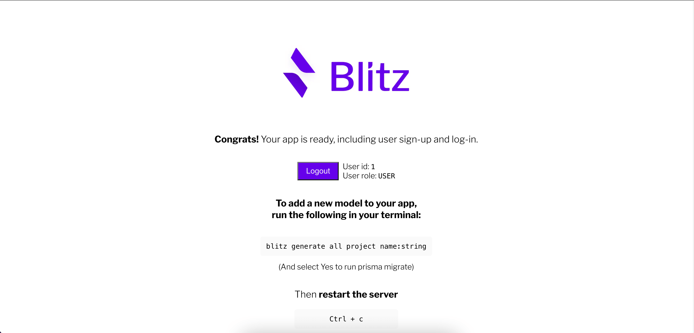

# Vote It

A simple web app built with [Blitz.js](https://github.com/blitz-js/blitz) that allows registered user to create questions with multiple choices and vote on those choices.

## Screenshots

<p align="left">
  
  &nbsp;
  
  &nbsp;
  
  &nbsp;
  
</p>

## Getting Started

Run your app in the development mode.

```
blitz dev
```

Open [http://localhost:3000](http://localhost:3000) with your browser to see the result.

## Environment Variables

Ensure the `.env.local` file has required environment variables:

```
DATABASE_URL=postgresql://<YOUR_DB_USERNAME>@localhost:5432/vote-it
```

Ensure the `.env.test.local` file has required environment variables:

```
DATABASE_URL=postgresql://<YOUR_DB_USERNAME>@localhost:5432/vote-it_test
```

## Tests

Runs your tests using Jest.

```
yarn test
```

Blitz comes with a test setup using [Jest](https://jestjs.io/) and [react-testing-library](https://testing-library.com/).

## Commands

Blitz comes with a powerful CLI that is designed to make development easy and fast. You can install it with `npm i -g blitz`

```
  blitz [COMMAND]

  dev       Start a development server
  build     Create a production build
  start     Start a production server
  export    Export your Blitz app as a static application
  prisma    Run prisma commands
  generate  Generate new files for your Blitz project
  console   Run the Blitz console REPL
  install   Install a recipe
  help      Display help for blitz
  test      Run project tests
```

You can read more about it on the [CLI Overview](https://blitzjs.com/docs/cli-overview) documentation.

## Tools included

Blitz comes with a set of tools that corrects and formats your code, facilitating its future maintenance. You can modify their options and even uninstall them.

- **ESLint**: It lints your code: searches for bad practices and tell you about it. You can customize it via the `.eslintrc.js`, and you can install (or even write) plugins to have it the way you like it. It already comes with the [`blitz`](https://github.com/blitz-js/blitz/tree/canary/packages/eslint-config) config, but you can remove it safely. [Learn More](https://blitzjs.com/docs/eslint-config).
- **Husky**: It adds [githooks](https://git-scm.com/docs/githooks), little pieces of code that get executed when certain Git events are triggerd. For example, `pre-commit` is triggered just before a commit is created. You can see the current hooks inside `.husky/`. If are having problems commiting and pushing, check out ther [troubleshooting](https://typicode.github.io/husky/#/?id=troubleshoot) guide. [Learn More](https://blitzjs.com/docs/husky-config).
- **Prettier**: It formats your code to look the same everywhere. You can configure it via the `.prettierrc` file. The `.prettierignore` contains the files that should be ignored by Prettier; useful when you have large files or when you want to keep a custom formatting. [Learn More](https://blitzjs.com/docs/prettier-config).

## Credits

- **Watch and Learn**'s [tutorial](https://youtu.be/oe5pwktPWts) on YouTube
